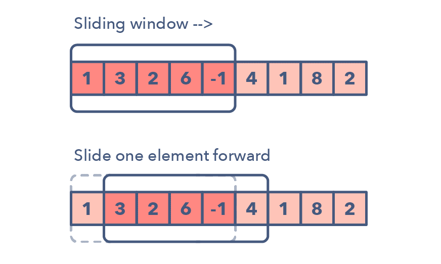

## 14 patterns to ace any coding interview question

[source link](https://dev.to/fahimulhaq/14-patterns-to-ace-any-coding-interview-question-d9g)


### 1. 滑动窗口

* 窗口大小可能变化
* 输入：线性结构（链表、数组、字符串）
* 问题：找出子串、子数组或需要的值等

问题：

* Maximum sum subarray of size ‘K’ (easy)
  * K大小的子数组的最大的和
* Longest substring with ‘K’ distinct characters (medium)
  *  K个不同字符的最长子串
* String anagrams (hard)
  * 字符串的变位词（anagrams），变位词不考虑顺序，即考虑数量，及哈希）




### 2. 双指针或迭代器

* 双指针起止位置可能不同（头、尾、中间等）
* 输入：有序的数组或链表
* 输出：查找符合条件的元素（例如：元素对 或 子数组等）

问题：

- Squaring a sorted array (easy)
- Triplets that sum to zero (medium)
- Comparing strings that contain backspaces (medium)


### 3. 快慢指针或迭代器

* 快慢指针可以处理带循环的链表或数组等
* 输入：线性结构 或 带循环
* 输入：找出元素位置或总体长度等

问题：

- Linked List Cycle (easy)
- Palindrome Linked List (medium)
- Cycle in a Circular Array (hard)


### 4. 区间合并

* 两个区间之间的关系有6种模式
* 输入：区间相关 
* 输出：合并的结果

问题：

- Intervals Intersection (medium)
- Maximum CPU Load (hard)


### 5. 循环排序

* 在一定范围内的数字（与下标有关）
* 一次遍历

问题特征：

* 一定范围内有序的数组
* 在有序数组或绕序数组（rotated array）内查找丢失的、重复的、最小的数组

问题：

- Find the Missing Number (easy)
- Find the Smallest Missing Positive Number (medium)


### 6. 就地逆转链表

* current变量（待处理）
* previous变量（已处理）

问题：

- Reverse a Sub-list (medium)
- Reverse every K-element Sub-list (medium)


### 7. 树形BFS

* 层序
* queue加入根节点，移除头节点时加入其子节点

问题：

- Binary Tree Level Order Traversal (easy)
- Zigzag Traversal (medium)

### 8. 树形DFS

* 递归（或使用栈）
  * pre-order: 先处理当前节点
  * in-order：在孩子之间处理当前节点
  * post-order：后处理当前节点
* 对当前节点的子节点进行递归调用

问题特征：

* 要求in-order, preoder or postorder遍历
* 要求搜索靠近叶子节点的相关信息

问题：

- Sum of Path Numbers (medium)
- All Paths for a Sum (medium)

### 9. 双堆

* Min Heap：小顶堆（用来找到最小元素）
* Max Heap：大顶堆（用来找到最大元素）

问题特征：

* 优先队列、调度问题等
* 需要查找smallest/largest/median元素

问题：

- Find the Median of a Number Stream (medium)

```c++
class MedianFinder {
public:
    std::priority_queue<int> q_smaller_max;  // max heap   
    std::priority_queue<int, 
        std::vector<int>, 
        std::greater<int>> q_larger_min; // min heap
    MedianFinder() {
    }
    
    void addNum(int num) {
        q_smaller_max.push(num);  // 进小堆过滤

        q_larger_min.push(q_smaller_max.top());  // 小堆中大的，进大堆
        q_smaller_max.pop();

        if (q_larger_min.size() > q_smaller_max.size())
        {
            // 大堆中小的， 进小堆平衡
            q_smaller_max.push(q_larger_min.top());
            q_larger_min.pop();
        }

        // smaller_size >= larger_size
    }
    
    double findMedian() {
        if (q_smaller_max.size() > q_larger_min.size())
        {
            return q_smaller_max.top();
        }
        else
        {
            return (q_smaller_max.top() + q_larger_min.top()) / 2.0;
        }
    }
};
```


### 10. 子集合

* 排列、组合相关问题
* 可以高效的进行BFS

实现步骤：[1, 5, 3]

1. 从空集开始[ [] ]
2. 复制已有子集，添加第一个数字到**所有已有的**子集合中生成新集合
3. 复制已有子集，添加第二个数字到**所有已有的**子集合中
4. 复制已有子集，添加第三个数字到**所有已有的**子集合中

问题：

- Subsets With Duplicates (easy)
- String Permutations by changing case (medium)


```c++
class Solution {
public:
    vector<vector<int>> subsets(vector<int>& nums) {
        vector<vector<int>> res;
        res.push_back(vector<int>());

        for (int i = 0; i < nums.size(); ++i)
        {
            vector<vector<int>> expand = res;
            for (int j = 0; j < expand.size(); ++j)
            {
                expand[j].push_back(nums[i]);
            }
            res.insert(res.end(), expand.begin(), expand.end());
        }

        return res;
    }
};
```


### 11. 修改的二分查找

* 输入：有序的数组、链表、矩阵等
* 输出：查找指定的元素

问题：

- Order-agnostic Binary Search (easy)
- Search in a Sorted Infinite Array (medium)


### 12. Top K Elements

* Heap

问题：

- Top ‘K’ Numbers (easy)
- Top ‘K’ Frequent Numbers (medium)


### 13. K路合并

* K个已排序数组进行总体排序

步骤：

1. K大小的Min Heap
2. 将K个数组的头部数据入堆
3. 出堆一个Min，入库该Min相应数组中的下一个元素

问题：

- Merge K Sorted Lists (medium)
- K Pairs with Largest Sums (Hard)


### 14. 拓扑排序

步骤：

1. 初始化：

   * 图的邻接链表，使用HashMap存储

   * 使用一个HashMap存储入度数量（count of in-degrees）

2. 计算顶点入度：构建图，使用数据填充入度HashMap

3. 查找源（sources）：入度为0的顶点，存入队列

4. 排序：

   * 对所有源：
     * 将源加入排序列表
     * 将源的子节点入度减1
     * 如果子节点入度为0，则加入队列

问题：

- Task scheduling (medium)
- Minimum height of a tree (hard)

